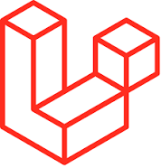
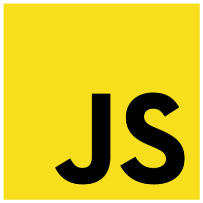

<h4 align="left">Hi, I'm Kevin okello 👋. A passionate fullstack developer from Nairobi, Kenya</h4>
<h4 align="left">🌱Shipping with:</h4>

 
 
   
   
   
              

<!--START_SECTION:waka--><!--END_SECTION:waka-->

